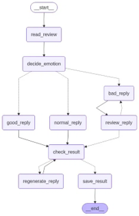
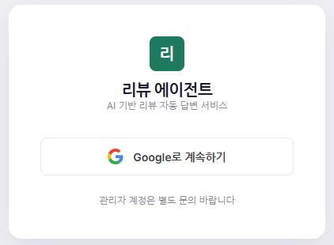
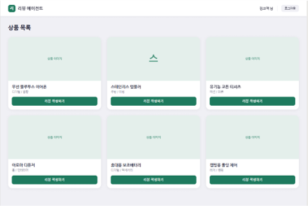
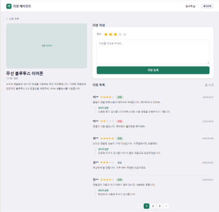
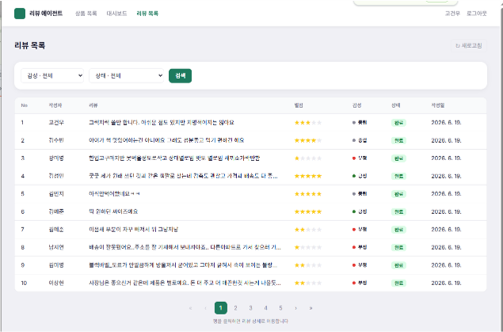
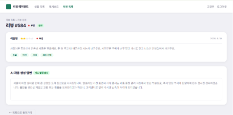
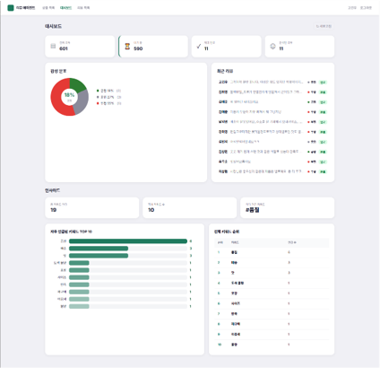

# 리뷰 에이전트 (Review Agent)

고객 리뷰를 LangGraph AI 파이프라인이 자동으로 분석하고, 감성에 맞는 답변을 생성·발행하는 풀스택 서비스입니다.

---

## 주요 기능

- **감성 자동 분류** — 리뷰를 긍정(good) / 중립(normal) / 부정(bad) 으로 분류
- **자동 답변 생성** — 감성별 맞춤 구조로 답변 생성 후 즉시 발행
  - 긍정: 감사 인사 + 재구매 유도
  - 중립: 감사 인사 + 개선 약속
  - 부정: 공감 · 사과 · 해결책 (품질 검사 포함, 최대 2회 재생성)
- **비동기 처리** — 리뷰 등록 즉시 완료 응답, 답변은 백그라운드에서 생성
- **키워드 인사이트** — 전체 리뷰 키워드 TOP N 집계 차트
- **구글 소셜 로그인** — OAuth2 + JWT 인증

---

## 기술 스택

| 영역 | 기술 |
|---|---|
| 프론트엔드 | React 19 · TypeScript · Tailwind CSS · Vite |
| 백엔드 | Django 5 · Django REST Framework · SimpleJWT |
| AI 파이프라인 | LangGraph · Gemini API (`gemini-3.1-flash-lite`) |
| 인증 | Google OAuth2 (django-allauth) |
| DB | MySQL 8 |
| 비동기 | Python threading |

---

## LangGraph 파이프라인



### State

노드 사이에서 공유되는 단일 상태 객체 `ReplyState`로 전체 파이프라인이 동작합니다.

| 필드 | 타입 | 설명 |
|---|---|---|
| `review_id` | `int` | 처리할 리뷰 PK |
| `text` | `str` | 리뷰 원문 |
| `rating` | `int` | 별점 1~5 |
| `emotion_label` | `str` | `good` / `normal` / `bad` — 분류 전 미설정 |
| `reply_text` | `str` | LLM이 생성한 답변 |
| `tags` | `list[str]` | 리뷰에서 추출한 키워드 리스트 |
| `retry_count` | `int` | 부정 답변 재생성 횟수 (최대 1회) |
| `regenerate_count` | `int` | 최종 답변 재생성 횟수 (최대 2회) |
| `bad_reply_quality_pass` | `bool` | 부정 답변 1차 품질 검사 결과 |
| `final_quality_pass` | `bool` | 최종 답변 품질 검사 결과 |

### 노드 상세

#### `read_review` — 리뷰 로드

DB에서 `review_id`로 리뷰를 조회하고, `status`를 `pending → processing`으로 변경하며 State를 초기화합니다.

---

#### `decide_emotion` — 감성 분류

별점과 리뷰 원문을 Gemini에 전달하고, `good / normal / bad` 중 하나를 반환받습니다.  
LLM이 세 값 외의 텍스트를 반환할 경우 `normal`로 안전하게 폴백합니다.

```
입력: 별점, 리뷰 원문
출력: emotion_label (good / normal / bad)
```

라우터 `route_by_analysis`가 `emotion_label` 값에 따라 다음 노드를 분기합니다.

---

#### `good_reply` / `normal_reply` — 긍정·중립 답변 생성

| 감성 | 답변 구조 | 분량 |
|---|---|---|
| 긍정 (good) | 감사 인사 + 재구매 유도 | 2~3문장 |
| 중립 (normal) | 감사 인사 + 개선 약속 | 2~3문장 |

LLM에게 `{ reply_text, tags }` JSON 형식으로만 응답하도록 지시하고, 마크다운 코드 블록이 포함된 경우 자동으로 제거합니다.  
두 노드 모두 생성 즉시 `check_result`로 진행합니다.

---

#### `bad_reply` — 부정 답변 생성

부정 리뷰는 공감·사과·해결책의 3단 구조를 필수로 요구합니다.  
재생성 요청(`retry_count > 0`)인 경우 프롬프트에 "공감, 사과, 해결책을 더 구체적으로 작성하라"는 가이드를 추가합니다.

```
입력: 별점, 리뷰 원문, retry_count
출력: reply_text, tags
→ review_reply(품질 검사)로 전달
```

---

#### `review_reply` — 부정 답변 1차 품질 검사

부정 리뷰에만 적용되는 전용 품질 게이트입니다.  
LLM이 아래 3가지 기준으로 `pass / fail`을 판정합니다.

1. **공감** — 고객의 불만을 이해하고 있는가
2. **사과** — 진심 어린 사과가 담겨 있는가
3. **해결책** — 구체적인 해결 의지나 방안이 있는가

라우터 `check_bad_reply`가 결과를 처리합니다.

```
fail + retry_count < 2  →  bad_reply (재생성)
pass 또는 retry_count ≥ 2  →  check_result
```

> 재시도 상한(`retry_count ≥ 2`)을 두어 무한 루프를 방지합니다.

---

#### `check_result` — 최종 품질 검사

모든 감성 경로(good / normal / bad)의 답변이 공통으로 거치는 최종 게이트입니다.  
LLM이 아래 3가지 기준으로 `pass / fail`을 판정합니다.

1. **자연스러운 문장**인가
2. **리뷰 내용과 연관**된 답변인가
3. **고객에게 도움**이 되는가

라우터 `last_check`가 결과를 처리합니다.

```
pass 또는 regenerate_count ≥ 2  →  save_result
fail  →  regenerate_reply (재생성)
```

---

#### `regenerate_reply` — 최종 답변 재생성

품질 미달 시 기존 `reply_text`를 함께 프롬프트에 넣어 "더 자연스럽고 구체적으로" 재작성을 요청합니다.  
답변 구조(감사·공감·사과·해결책)는 유지하고 표현만 개선하도록 지시합니다.  
재생성 후 다시 `check_result`로 돌아가며 최대 2회까지 시도합니다.

---

#### `save_result` — 결과 저장

최종 통과한 답변을 DB에 저장하고 리뷰 상태를 `done`으로 업데이트합니다.

```python
review.emotion_label = state["emotion_label"]
review.status = "done"
ReviewReply.objects.create(review=review, reply_text=state["reply_text"])
for tag in state["tags"]:
    ReviewTag.objects.create(review=review, tag=tag)
```

---

### 품질 검사 루프 요약

부정 리뷰는 최악의 경우 아래 순서로 최대 **8회** LLM을 호출합니다.

| 단계 | 노드 | 결과 |
|---|---|---|
| 1 | `bad_reply` — 답변 생성 | |
| 2 | `review_reply` — 1차 품질 검사 | fail |
| 3 | `bad_reply` — 재생성 (retry 1회) | |
| 4 | `review_reply` — 1차 품질 검사 | pass 또는 상한 도달 |
| 5 | `check_result` — 최종 품질 검사 | fail |
| 6 | `regenerate_reply` — 재생성 (regenerate 1회) | |
| 7 | `check_result` — 최종 품질 검사 | fail |
| 8 | `regenerate_reply` — 재생성 (regenerate 2회, 상한 도달) | |
| — | `save_result` — 저장 | 완료 |

긍정·중립 리뷰는 `check_result`를 한 번만 거치므로 최소 **3회** LLM 호출로 완료됩니다.

---

### 비동기 처리 구조

Django 뷰는 리뷰 저장 즉시 `201 Created`를 반환하고, `threading`으로 파이프라인을 백그라운드 실행합니다.  
사용자는 답변 생성을 기다리지 않아도 됩니다.

```
POST /api/reviews/create/
    │
    ├── Django: Review 저장 (status=pending) → 즉시 201 응답
    │
    └── [background thread]
          REPLY_DELAY_MINUTES 대기 (기본 10분)
            └→ LangGraph 파이프라인 실행 (10~30초)
                  └→ status=done, reply/tags DB 저장
```

`.env`의 `REPLY_DELAY_MINUTES`로 대기 시간을 조정할 수 있습니다.

---

## 화면 구성

### 로그인



### 상품 목록



### 상품 상세 / 리뷰 작성



### 관리자 리뷰 목록



### 관리자 리뷰 상세



### 대시보드



---

## 프로젝트 구조

```
reviewagent/
├── assets/
│   ├── pipeline.png              # LangGraph 파이프라인 다이어그램
│   └── screenshots/              # UI 화면 캡처
├── backend/
│   ├── config/                   # Django 설정, URL 라우팅
│   ├── reviews/                  # 모델, 뷰, 시리얼라이저
│   ├── pipeline/                 # LangGraph 그래프, State 정의, 시드 데이터
│   ├── nodes/                    # 파이프라인 노드 (분류, 답변 생성, 품질 검사, 저장)
│   ├── .env.example
│   └── manage.py
└── frontend/
    └── src/
        ├── pages/                # 고객 화면, 관리자 화면
        ├── components/           # 공통 레이아웃, UI 컴포넌트
        ├── context/              # AuthContext (JWT)
        └── api/                  # axios 클라이언트
```

---

## 시작하기

### 사전 요구사항

- Python 3.11+
- Node.js 18+
- MySQL 8
- [uv](https://github.com/astral-sh/uv) (Python 패키지 매니저)
- Google Cloud 프로젝트 및 OAuth2 클라이언트 ID
- Gemini API 키

### 1. MySQL 데이터베이스 생성

```sql
CREATE DATABASE reviewagentdb CHARACTER SET utf8mb4 COLLATE utf8mb4_unicode_ci;
CREATE USER 'reviewagent'@'localhost' IDENTIFIED BY '1234';
GRANT ALL PRIVILEGES ON reviewagentdb.* TO 'reviewagent'@'localhost';
FLUSH PRIVILEGES;
```

### 2. 백엔드 설정

```bash
cd backend

# 환경 변수 설정
cp .env.example .env
# .env 파일을 열어 아래 값 입력
```

`.env` 파일:

```env
GEMINI_API_KEY=your_gemini_api_key

DJANGO_SECRET_KEY=your_django_secret_key

DB_NAME=reviewagentdb
DB_USER=reviewagent
DB_PASSWORD=your_db_password
DB_HOST=localhost
DB_PORT=3306

GOOGLE_CLIENT_ID=your_google_client_id
GOOGLE_CLIENT_SECRET=your_google_client_secret

REPLY_DELAY_MINUTES=10
```

```bash
# 패키지 설치
uv sync

# DB 마이그레이션
uv run python manage.py migrate

# 개발 서버 실행
uv run python manage.py runserver
```

### 3. 프론트엔드 설정

```bash
cd frontend
npm install
npm run dev
```

프론트엔드: `http://localhost:5173`  
백엔드 API: `http://localhost:8000`

### 4. 시드 데이터 적재 (선택)

네이버 쇼핑 공개 데이터셋 300건을 DB에 적재합니다.

```bash
cd backend
uv run python pipeline/seed_data.py
```

> 시드 데이터는 `pending` 상태로만 저장됩니다. 아래 스크립트로 파이프라인을 수동 실행하세요.

```bash
uv run python pipeline/reply_workflow.py
```

---

## API 엔드포인트

| 메서드 | URL | 설명 | 권한 |
|---|---|---|---|
| GET | `/api/products/` | 상품 목록 | 인증 |
| GET | `/api/products/:id/` | 상품 상세 + 리뷰 | 인증 |
| POST | `/api/reviews/create/` | 리뷰 등록 | 인증 |
| GET | `/api/reviews/` | 전체 리뷰 목록 | 관리자 |
| GET | `/api/reviews/:id/` | 리뷰 상세 | 관리자 |
| GET | `/api/dashboard/` | 대시보드 통계 | 관리자 |
| GET | `/api/insights/tags/` | 키워드 TOP N | 관리자 |

---

## 인증 흐름

```
고객 → 구글 로그인 → django-allauth OAuth2 처리
      → JWT 발급 (payload에 role, name 포함)
      → 프론트엔드 /auth/callback 으로 리디렉트
      → localStorage에 access/refresh 토큰 저장
      → role 값으로 고객/관리자 화면 분기
```

> 최초 로그인 시 `users` 테이블에 자동 등록됩니다.  
> 관리자 권한 부여: DB에서 `role` 컬럼을 `admin`으로 직접 수정하세요.

---

## 환경 변수 목록

| 변수명 | 설명 | 기본값 |
|---|---|---|
| `GEMINI_API_KEY` | Gemini API 키 | — |
| `DJANGO_SECRET_KEY` | Django 시크릿 키 | — |
| `DB_NAME` | MySQL 데이터베이스명 | `reviewagentdb` |
| `DB_USER` | MySQL 사용자 | `reviewagent` |
| `DB_PASSWORD` | MySQL 비밀번호 | — |
| `DB_HOST` | MySQL 호스트 | `localhost` |
| `DB_PORT` | MySQL 포트 | `3306` |
| `GOOGLE_CLIENT_ID` | Google OAuth 클라이언트 ID | — |
| `GOOGLE_CLIENT_SECRET` | Google OAuth 클라이언트 시크릿 | — |
| `REPLY_DELAY_MINUTES` | 리뷰 등록 후 답변 생성까지 대기 시간(분) | `10` |
